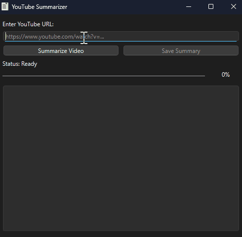

# ▶️ YouTube Summarizer


A desktop application built with Python that **summarizes YouTube videos using AI**. Simply provide a video URL, and the app will download the audio, transcribe it to text, and generate a concise, easy-to-read summary.

This project is ideal for:
- **Students & Researchers** → quickly extracting key information from educational content and lectures.
- **Professionals** → getting the main points from long meetings, interviews, or podcasts hosted on YouTube.
- **Anyone** → saving time by understanding a video's content without watching it entirely.

---

## 🚀 Features

- ✅ **Audio Extraction** via `yt-dlp` & `FFmpeg`
- ✅ **AI-Powered Transcription** with OpenAI's Whisper
- ✅ **AI-Powered Summarization** using the high-speed Groq API
- ✅ **Responsive GUI** built with PySide6 that won't freeze during processing
- ✅ **Real-time Feedback** with a status label and progress bar
- ✅ **Save Summary** functionality to export the result to a `.txt` file

---

## 📸 Visual Demo



---

## 📑 Table of Contents

- [Features](#-features)
- [Visual Demo](#-visual-demo)
- [Installation](#-installation)
- [Usage](#-usage)
- [Technologies Used](#-technologies-used)
- [Project Structure](#-project-structure)
- [Testing](#-testing)
- [Contributing](#-contributing)
- [License](#-license)

---

## ⚙️ Installation

Follow these steps to set up and run the project locally.

### 1. Requirements
- Python 3.10+
- [pip](https://pip.pypa.io/en/stable/)
- Virtualenv (recommended)

### 2. External Dependency: FFmpeg

This project requires **FFmpeg** for audio conversion. You must install it and add it to your system's PATH.

**On Windows:**
1.  **Download:** Go to the [FFmpeg official builds page](https://www.gyan.dev/ffmpeg/builds/) and download a release build (e.g., `ffmpeg-release-full.7z`).
2.  **Extract:** Unzip the file to a permanent location on your computer, for example, `C:\ffmpeg`.
3.  **Add to PATH:**
    * Press the Windows key, type `env`, and select "Edit the system environment variables".
    * Click the "Environment Variables..." button.
    * Under "System variables", find and double-click the `Path` variable.
    * Click "New" and paste the full path to the `bin` folder inside your extracted FFmpeg folder (e.g., `C:\ffmpeg\ffmpeg-7.0-full_build\bin`).
    * Click OK on all windows to save.
4.  **Verify:** Open a **new** terminal and run `ffmpeg -version`. If it shows version information, you are all set.

### 3. Setup Steps

```bash
# 1. Clone the repository
git clone https://github.com/MatheusBarbosaSE/youtube-summarizer.git
cd youtube-summarizer

# 2. Create and activate a virtual environment
python -m venv .venv
# On Windows
.venv\Scripts\activate
# On macOS/Linux
source .venv/bin/activate

# 3. Install Python dependencies
pip install -r requirements.txt
```

### 4. API Key Setup

The application uses the Groq API for summarization. You need a free API key.

1.  **Get a Key:** Go to [console.groq.com/keys](https://console.groq.com/keys), sign up for a free account, and create a new API key. Copy the key.
2.  **Create a `.env` file:** In the **root folder** of the project, create a file named exactly `.env`.
3.  **Add Your Key:** Open the `.env` file and add the following line, pasting your key inside the quotes:

    ```
    GROQ_API_KEY="YOUR_SECRET_GROQ_API_KEY_HERE"
    ```
    
4.  **Security:** The `.gitignore` file is already configured to ignore the `.env` file, so your key will remain private and will not be committed to Git.

---

## 💻 Usage

After completing the installation, run the application from the project's **root directory**:

```bash
python src/gui.py
```

1.  The application window will open.
2.  Paste a YouTube video URL into the input field.
3.  Click the "Summarize Video" button.
4.  Watch the status label and progress bar for real-time updates.
5.  Once finished, the summary will appear in the text area.
6.  Click the "Save Summary" button to save the result to a `.txt` file.

---

## 🛠 Technologies Used

- **Backend & Logic**
  - [Python](https://www.python.org/)
  - [yt-dlp](https://github.com/yt-dlp/yt-dlp): For downloading video audio.
  - [OpenAI Whisper](https://github.com/openai/whisper): For high-accuracy audio transcription.
  - [Groq API](https://groq.com/): For high-speed AI text summarization.
  - [python-dotenv](https://github.com/theskumar/python-dotenv): For managing environment variables.
- **GUI**
  - [PySide6](https://www.qt.io/qt-for-python): The official Qt for Python library for building the graphical user interface.
- **External Dependencies**
  - [FFmpeg](https://ffmpeg.org/): The core tool for audio processing and conversion.

---

## 📂 Project Structure

```
youtube-summarizer/
│
├── .venv/                    # Virtual environment folder (ignored by Git)
├── demo/                     # Media used in README
│
├── src/                      # Source code for the application
│   ├── audio_downloader.py   # Module for downloading audio
│   ├── gui.py                # Main GUI application logic
│   ├── icon.ico              # Application icon
│   ├── summarizer.py         # Module for summarizing text
│   └── transcriber.py        # Module for transcribing audio
│
├── .env                      # Stores the secret API key (ignored by Git)
├── .gitignore                # Ignore rules for Git
├── LICENSE                   # MIT license
├── main.py                   # Script for command-line pipeline integration
├── README.md                 # Project documentation
└── requirements.txt          # Python dependencies
```

---

## 🧪 Testing

This project does not use a formal testing framework like `pytest`. However, each core backend module contains a simple, built-in test block that allows for independent validation.

You can run each module directly to test its specific functionality:

```bash
# Test only the audio downloader
python src/audio_downloader.py

# Test only the audio transcriber (will download a test file first)
python src/transcriber.py

# Test only the AI summarizer with a sample text
python src/summarizer.py
```
These scripts are useful for debugging a specific part of the pipeline without running the entire process.

---

## 🤝 Contributing

1. Fork the repository
2. Create a feature branch (`git checkout -b feature/new-feature`)
3. Commit your changes (`git commit -m 'feat: add new feature'`)
4. Push to the branch (`git push origin feature/new-feature`)
5. Open a Pull Request

Feel free to open **issues** for bug reports or suggestions.

---

## 📄 License

This project is licensed under the **[MIT License](LICENSE)**.  
You are free to use, copy, modify, and distribute this software, provided you keep the original credits.
